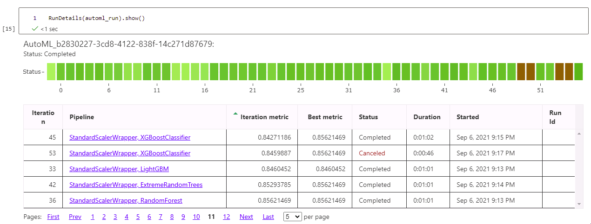
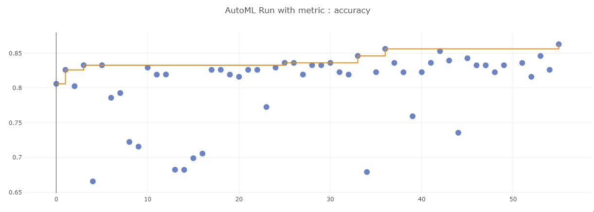
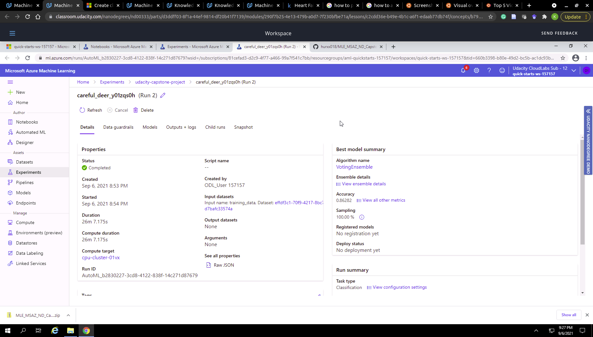
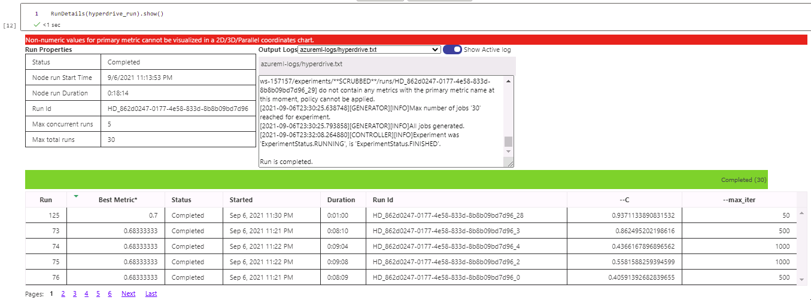
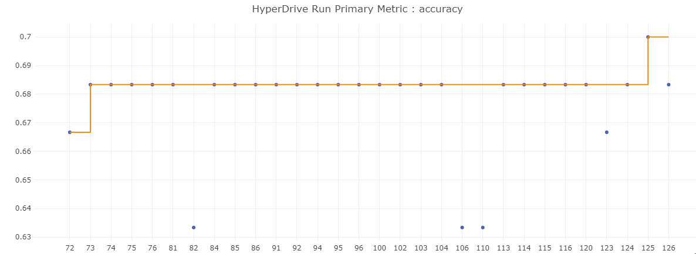
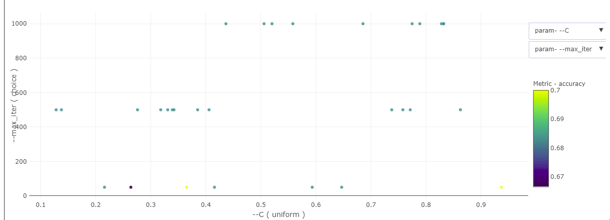
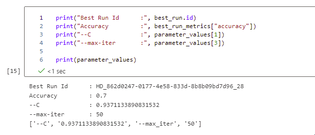
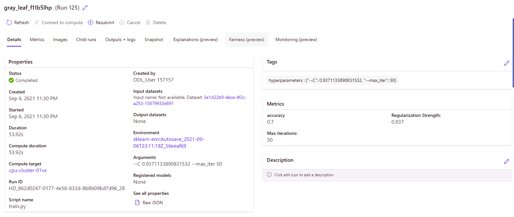

# Capstone: Prediction of Heart Failure 

Cardiovascular diseases (CVDs) are the number 1 cause of death globally. 
CVDs commonly cause heart failures. 
Early detection of heart failure is one way of addressing the problem. 
Here we used machine learning approach to build a classification model relying on a Heart Failure prediction dataset. 
This dataset is available in Kaggle. 
The dataset consists of 12 features that are cardiovascular disease, hypertension, diabetes and so on.

Here, we applied two methods: HyperDrive and AutoML. 
Logistic regression algorithm was run with HyperDrive where two hyperparameters of C and max-iter were tested.
AutoML was run with random parameter sampling and bandit early stopping policy. 

The best model of VotingEnsemble was determined by the AutoML run. 
Its accuracy was ~0.86 that was larger than the best accuracy ~0.7 of logistic regression with HyperDrive.

The VotingEnsemble model was deployed for the consumption.

## Project Set Up and Installation
This project was completed in the defalut setting of the AzureML.

## Dataset

### Overview
The dataset called Heart Failure clinical records was obtained from Kaggle. 

It has 12 features such as cardiovascular age, disease, hypertension, diabetes and so on. 
DEATH_EVENT was a predicted attribute for our classification model. 

Input features are the following:
age, anaemia, creatinine_phosphokinase, diabetes, ejection_fraction,
high_blood_pressure, platelets, serum_creatinine, serum_sodium, sex, smoking, time

Output is DEATH_EVENT

### Task
The goal was to build a binary classification model of predicting "DEATH_EVENT". 
The model was developed with using the other 11 input features.

### Access
The data of heart_failure_clinical_records_dataset.csv was uploaded to Datastore in Azure with the name of "HeartFailurePrediction".

## Automated ML

The AutoML for the classification was run with the primary metric of accuracy. 
The cross validation was applied to avoid the overfitting. 
The running time was limited to be within 30 minutes. 
The concurrent iteration was applied. 

### Results

The AutoML found out the best performance model of VotingEnsemble with the accuracy of 0.86. 
The neural network will be tested to see if the accuracy is improved.

Screenshots of the `RunDetails` widget  

  

The best performance model of VotingEnsemble  

## Hyperparameter Tuning

Logistic regression was used to build the binary classification model that is the simplest approach. 
Logistic regression allowed us to a kind of banchmarking result that we can estimate the accuracy of our classification model.
Two hyperparameters of the inverse of regularization (C) and the maximum number of iterations (max-iter) were chosen to run HyperDrive.
C is chosen to control the effective size of parameters.
It was randomly selected from a uniform distribution of (0.1, 1.0).
max-iter was tested to determine how long the training should be done to find an optimal model.
It was randomly selected from four values of 50, 100, 500, and 1000.

For each run, the two parameters were randomly selected (RandomParameter Sampling).
For the early stopping policy, we chose BanditPolicy that seems to be efficient of choosing the early stopping point.

### Results

The best model of logistic regression algorithm was determined with C~0.94 and max-iter=50.
I will run HyperDrive after adjusting the range of C to be between 0.9 and 1.5. 

RunDails of HyperDrive
()  
  

  

Best model of logistic regression  

## Model Deployment

The best model of VotingEnsemble algorithm was determined by AutoML. 
This model was deployed as a web service.

The example of querying the endpoint is provided with endpoint.py, 
where scoring_uri and key must be updated. 
Here is a command: 
python ./endpoint.py

## Screen Recording
a link to a screen recording of the project in action:
https://youtu.be/Pyx4JLoXeA4

**Demo of the deployed model**
The best performant model was deployed as a web service in this project. 
The 
**Demo of a sample request sent to the endpoint and its response**
Get scoring_uri. 
Make sure that key is available, 
because authentication was enabled in the deployment.
Data was set up to be a dictionary with the key "data" and its value list with two elements. 
That data is stored in a json file (data.json). 

